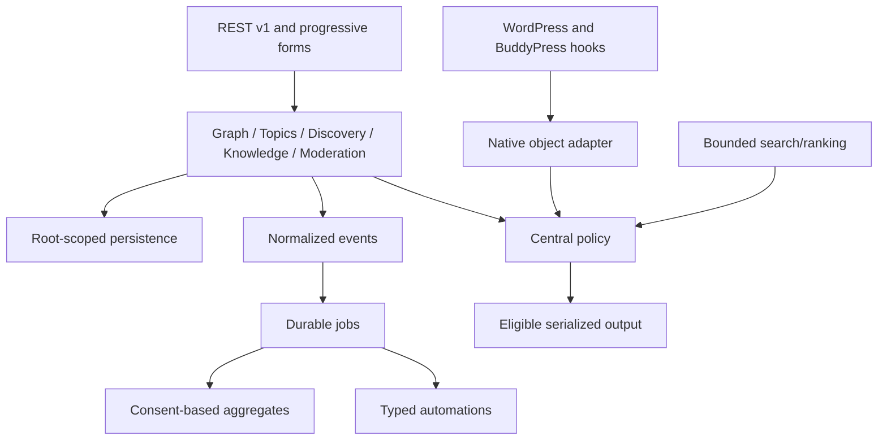

# Architecture and developer guide

## Boundaries

The plugin is a modular monolith with 24 PHP classes/interfaces, a dependency-free runtime loader, three frontend assets, and 19 custom tables. `Core` composes services once per WordPress request. Domain/application services receive explicit dependencies; the REST controller and server renderer share the same validation and authorization boundary.

`Database` allows known table/column names, prepares values, implements unique insertion without hiding unrelated SQL errors, and uses nested savepoints. Failed reads throw rather than masquerading as empty privacy datasets. Queue state writes use at most three autocommit attempts for native deadlock/lock-timeout codes, with bounded backoff and restored error-suppression state. `retryAutocommit` accepts one statement and rejects a transaction context; callers must never pass handlers or multi-statement work. Completion retries are outside handler error handling, preserving a running lease if completion ultimately fails. Built-in handlers remain idempotent for later stale-lease recovery. `NativeObjects` normalizes canonical members, groups, activity, topics, entries and public posts. `Policy` applies native visibility, bilateral blocks, author privacy, restrictions and recommendation-specific mutes. Extensions can tighten its result; they cannot turn a core denial into an allowance.

`Events` accepts known types and scalar metadata only. `Jobs` claims work atomically, bounds batch size/retries and recovers expired leases. `Automation` persists `(rule,event)` identity and locks its run before execution. Knowledge acceptance locks the question and serializes reputation limits through a plugin-owned mutex row. No SQL entered by an administrator is evaluated.

## Verified upstream integrations

Symbols were inspected in BuddyPress 14.5.2 source before use. The adapter uses `bp_core_get_users`, `groups_get_group`, `groups_get_groups`, `groups_is_user_member`, `groups_is_user_banned`, `bp_activity_get`, `bp_activity_get_specific`, `bp_activity_get_permalink`, native metadata APIs, member-type APIs, `friends_check_friendship`, and `bp_notifications_add_notification`. URL integration uses the BuddyPress 12+ member/group URL APIs; older versions are intentionally gated out.

UI hooks: `bp_setup_nav`, `bp_core_new_nav_item`, `bp_template_content`, `bp_core_load_template`, member/group header actions and activity entry metadata. Query hooks: `bp_activity_get`, `bp_activity_get_specific`, `bp_core_get_users`, `groups_get_groups`, and `bp_rest_activity_prepare_comments`. Native REST object paths are checked at WordPress `rest_pre_dispatch`. Nested activity comments are recursively filtered without mutating the cached upstream object.

Interaction hooks: verified `bp_activity_before_save` can populate the upstream error object before insertion, and `messages_message_before_save` can empty recipients before `send()` inserts. The latter rejects the entire send if one recipient is forbidden, including replies to a thread. Existing messages and recipient lists are not ingested or deleted.

Native friendship REST creation and acceptance use the verified `bp_rest_friends_create_item_permissions_check` and `bp_rest_friends_update_item_permissions_check` filters. Both participants must be eligible. Legacy and Nouveau AJAX preflights run before their native handlers, which retain nonce and ownership checks. Add/accept screens are guarded at `bp_actions` / `bp_screens` priority zero. New-request buttons are omitted for ineligible pairs; removal, rejection and withdrawal remain available. Native REST friendship reads filter both participants and receive private/no-store headers; filtered pages can be shorter. The REST update/delete paths use the other member ID, while the read-detail path uses the friendship ID. Tests cover these distinct contracts. Direct PHP or third-party writers must consult the published policy before writing; native friendship persistence has no supported universal abort boundary.

Native events: user registration/profile changes, xprofile updates, activity save/comment/favorite, group join/leave and friendship acceptance/confirmed deletion. Removal uses `friends_friendship_post_delete`; the similarly named `friends_friendship_deleted` fires before persistence and may provide a null ID. Optional component hooks are registered only when enabled. Notification formatting uses verified component and notification filters.

The one read-only SQL adapter to upstream storage batches confirmed friendship relationships using the verified `BP_Friends_Friendship` table and its indexed initiator/friend fields. It is isolated in `NativeObjects::primeFriends`; individual checks retain the public API fallback. Upstream source is never patched. Native queries still retain upstream query costs; the plugin bounds its own candidate/scoring work.

## Extension API v1

| Hook | Contract |
|---|---|
| `bpi_ready` action | Array containing composed `events`, `policy` and `topics` services for explicitly registered integrations |
| `bpi_policy_allow` filter | `(true, viewerId, normalizedObject, recommendationContext)`; invoked only after all built-in restrictions pass; return false to tighten |
| `bpi_ranking_signals_v1` filter | `(signals, normalizedObject, viewerId)`; six normalized signals; final score clamps inputs |
| `bpi_search_provider_v1` filter | `(defaultProvider, canonicalType)`; return `SearchProvider`; supply candidate IDs only; hydration/authorization remains mandatory |
| `bpi_intelligence_provider_v1` filter | Disabled provider by default; return `IntelligenceProvider`; invoked only after consent/public-content checks |
| `bpi_operation_failed` action | Operation section identifier, without request data or exception text |
| `bpi_event_failed` action | Event type, without raw payload |
| `bpi_job_failed` action | Job ID, known kind, attempt number |

Search contract: `candidates(string $type, int $limit, int $page = 1, string $query = ''): array`; each candidate has an integer `id`. The default adapter works locally. A provider failure falls back to the native adapter. Candidate bodies or authorization assertions supplied by a provider are discarded.

Intelligence contract: `process(string $capability, string $publicText): array`, returning `['available'=>bool,'data'=>array]`. Capabilities are `embed`, `classify`, `moderate`, `summarize`. The disabled implementation returns unavailable. The HTTP adapter sends `{"capability":"summarize","text":"..."}` and expects `{"data":{...}}`. Output is untrusted, bounded and sanitized. Custom provider code runs inside WordPress's trusted plugin boundary and must enforce its own transport security; it receives only the already minimized editorial text.

No vendor SDK, embedding store, or semantic index is bundled. Semantic search can be implemented behind `SearchProvider` without weakening canonical hydration or policy. AI classifications never automatically apply moderation decisions.

## Ranking methodology

Candidate windows default to 150, capped at 300 and divided between requested types. Personalized feed generation also considers up to 50 items from the most recent 100 followed members, within the same final bound. Latest remains chronological. Additional source windows are explicit and bounded to 1,000.

For You combines recency, follow, topic affinity, relationship strength, quality and exploration. Default weights are `.25, .25, .20, .10, .10, .10`, normalized by their sum. Recency uses a 72-hour half-life. Relationship strength combines follow `.3`, mutual follow `.2`, friendship `.3` and bounded meaningful interaction evidence `.2`. Eligible consenting interaction history is capped at 30 records and decays with a 30-day half-life; repeated interactions with the same object count once. Private messages and inferred sensitive traits are excluded.

Trend uses distinct participants and capped replies over a recent event window, with 24-hour age decay. Quality includes visible accepted-answer evidence and explicit activity feature markers. Ledger evidence decays over 180 days and is log-normalized. Expert ranking requires explicit skill/help declarations and weights topic overlap `.5`, visible evidence `.4` and recency `.1`.

Feedback applies item, author and topic penalties. Not-interested items are checked again on cached feed retrieval. Search may still return a visible item explicitly requested by the member. Diversity caps author/group dominance at 40%, first-topic dominance at 60%, and consecutive items from one author at two; restricted candidates are never reintroduced to fill an empty page. Sparse pools can return fewer results.

Sorting uses score, canonical type and descending ID as deterministic tie breakers. Cursors hold IDs and explanation keys only for five minutes, bound to root, member, query, filters, mode, size and source window. Every retrieval rechecks canonical objects and current policy. Scores are descriptive, not claims of machine-learned relevance or certified expertise.

## Multisite and embedding

Tables/options/capabilities/cron belong to the BuddyPress root. Use `bp_current_user_can`/`bp_user_can` for root capabilities, rather than child-site role authority. Native posts are supported only on the root site. Cross-network sharing and automatic root relocation are not provided; changing the BuddyPress root requires a reviewed data migration.

Exclude personalized embeds from page caches and do not put REST responses into public caches. The REST response is `private, no-store`. If another plugin builds a surface from raw SQL or another REST namespace, it must explicitly consult `Policy`; this extension cannot globally intercept arbitrary application code.
